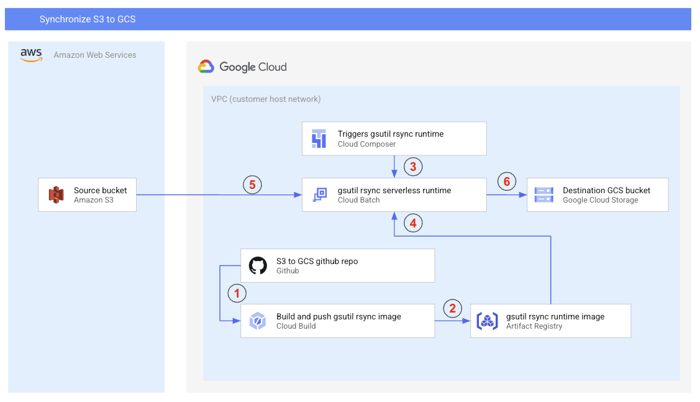
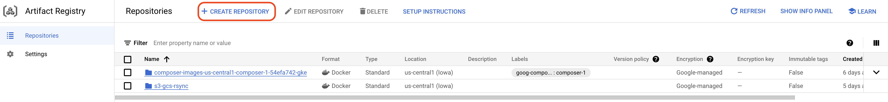
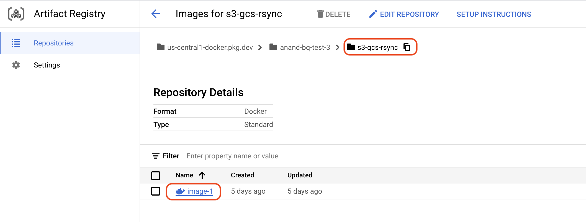

# s3-gcs-rsync-batch
# Overview
This application will synchronize contents of S3 folder to GCS folder in batch mode using Google Cloud Batch, Google Cloud Composer.

# Architecture



# Build instructions
## Prerequisite
The following prerequisite are required for the build

### Enable Google Cloud services
[Instal Google Cloud SDK](https://cloud.google.com/sdk/docs/install)

Enable the following services.

* [Cloud Build API](https://cloud.google.com/build/docs)
* [Artifact Registry API](https://cloud.google.com/artifact-registry/docs)
* [Batch API](https://cloud.google.com/batch/docs/get-started)

You can check if these services are enabled by running these commands
```sh
export PROJECT_ID=<YOUR_PROJECT_ID>

gcloud services list --enabled --project $PROJECT_ID | grep -E "cloudbuild.googleapis.com|artifactregistry.googleapis.com|batch.googleapis.com"
```

### Setup Artifact registry
To setup [Google Cloud Artifact registry](https://cloud.google.com/artifact-registry/docs) you first need to create a repository.



Once you create the repository you can select the resposity and copy the link to the repository



You can then append the name of the image to repository location to get the final image location.

## Clone the repo
Clone this repo for building the application image in your environment.

```sh
git clone https://github.com/anandj123/s3-gcs-rsync-batch.git && cd s3-gcs-rsync-batch

```
### Google Cloud CLI (command line interface) setup
Setup Google Cloud IAM permissions for access to read GCS files and write to BigQuery tables.

Get the authentication token to run this application for your GCP project. 

```sh
gcloud auth application-default login
gcloud config set project <YOUR_PROJECT_NAME>
```

For authenticating with a service account See more at 
[Authenticating as a service account](https://cloud.google.com/docs/authentication/production).


### Setup environment variables for the application

The following environment variables are required for the application.

```sh
export PROJECT_ID=<YOUR_PROJECT_ID>
export GCS_LOCATION=<TARGET_GCS_LOCATION>
export S3_LOCATION=<SOURCE_S3_LOCATION>
export AWS_ACCESS_KEY=<AWS_ACCESS_KEY>
export AWS_SECRET_ACCESS_KEY=<AWS_SECRET_ACCESS_KEY>
export REGION=<YOUR_REGION>
export IMAGE_LOCATION=us-central1-docker.pkg.dev/anand-bq-test-3/s3-gcs-rsync/image-1
export COPY_JOB_NAME=S3-to-GCS-2
```

|Variable Name|Description|
|---|---|
|PROJECT_ID|Provide your project id. |
|GCS_LOCATION| Provide GCS location for destination bucket e.g. **gs://bucket_name/folder_name/** |
|S3_LOCATION| Provide S3 source locatiion e.q. **s3://bucket_name/folder_name** |
|AWS_ACCESS_KEY|Provide the AWS_ACCESS_KEY, this will be stored inside the container image. |
|AWS_SECRET_ACCESS_KEY|Provide the AWS_SECRET_ACCESS_KEY, this will be stored inside the container image. |
|REGION|Provide the Google Cloud region for your application. e.g. **us-east1** |
|IMAGE_LOCATION|Provide the artifact registry location e.g. **us-docker.pkg.dev/<YOUR_PROJECT_ID>/s3-gcs-rsync/s3-gcs-rsync:latest**. Refer to [setup artifact registry section for more details](#setup-artifact-registry)|
|COPY_JOB_NAME|Name the copy job e.g. **S3-to-GCS-Copy-1**|


### Google Cloud Build application
Build the application using Google Cloud Build.

```sh
chmod +x cloud-build.sh 
./cloud-build.sh 
```

1. This above command will build the image using [Google Cloud Build](https://cloud.google.com/build) and push the build image to ```$IMAGE_LOCATION```

2. Create a Composer DAG (Directed Acyclic Graph) python file that you can deploy for triggering the Google Cloud Batch job. The name of the dag file will be ```$COPY_JOB_NAME-dag.py```

3. It will create a shell script that will invoke the Google Cloud Batch job using ```curl``` command. The file will be located at ```scripts/$COPY_JOB_NAME.sh```

# Test the application

To manually test the configuration you can invoke the Google Cloud Batch by running 
```sh
chmod +x script/$COPY_JOB_NAME.sh
script/$COPY_JOB_NAME.sh
```

# Deploy to Cloud Composer for scheduled runs
To deploy the Google Cloud composer job, copy
1. ```$COPY_JOB_NAME-dag.py``` to ```DAG``` folder of your Google Cloud Composer environment.
2. ```scripts/$COPY_JOB_NAME.sh``` to ```DAG/scripts``` folder of your Google Cloud Composer environment.


